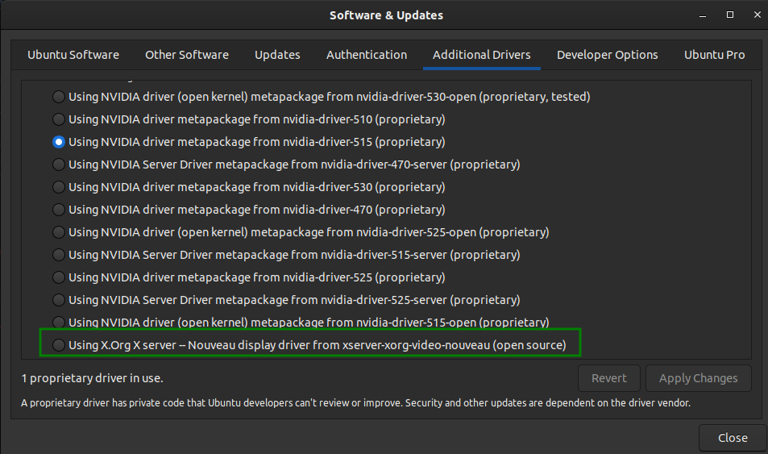
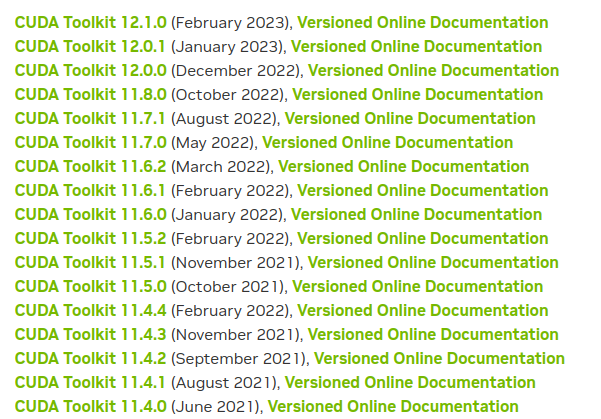
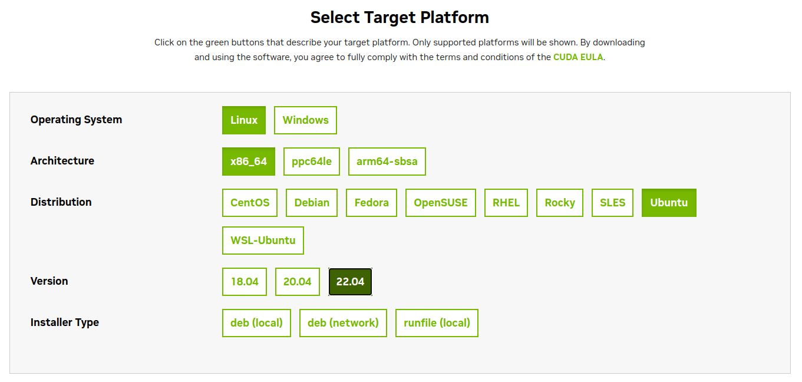
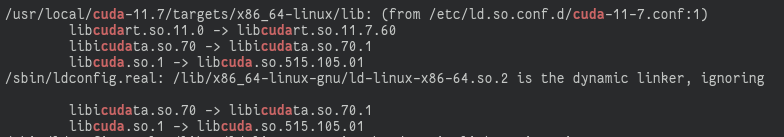

## Overview

This is quick guide on how to install NVIDIA CUDA Toolkit on Ubuntu (tested on 22.04). What we'll install are:

1. NVIDIA Driver
2. NVIDIA CUDA Toolkit
3. NVIDIA CUDA Samples
4. PyTorch (GPU Support with CUDA)

## Challenges

Installing Linux distribution on NVIDIA GPU-equipped computer has been quite a challenge, mostly on getting the latest and greatest driver as opposed to, i.e., Windows. Thus it sparks motivation from Open Source community to develop open-source driver alternative for NVIDIA GPU in Linux and some have been working well, for example, [Nouveau][1] project. Nouveau has been chosen as default generic NVIDIA GPU driver in certain distros, e.g., Ubuntu for years. Plenty die-hard open source folks use Nouveau for quite some time (including me) until problems arised.

Enter GPU computing, which allows software developers to accelerate their application by offloading computation hungry parts of their code into GPU. This requires GPU APIs and some out there that are populars, e.g., OpenCL and [CUDA][2]. Since I have NVIDIA GPU, we will need to setup CUDA and this is where Nouveau won't work due to lack of support for it, hence we'll need to use NVIDIA propietary drivers.

## Selecting Version of CUDA Toolkit

Plenty of you who went through installation of NVIDIA propietary drivers, might need the driver for either maximizing your GPU performance for 3D contents or entertainment. Getting the latest version of the driver is always priority and why shouldn't you? New version supports new games and fix many bugs.

But that is not the case if you're going to install CUDA, as things are intertwined between every parts of CUDA itself. From the driver, toolkit, libraries as well as further components for your AI/ML works, e.g. TensorFlow or PyTorch. This challenges users to be little bit more careful when it comes to order of installations to avoid problems and compatibility issues.

## Steps

#### 1. Disable Nouveau driver (tested on Ubuntu 22.04)

Since I am running Ubuntu, most likely on the first boot you'll have Nouveau driver installed. Easiest way to ensure which driver you're running is by going to **Software & Updates** app and check what is installed.



If you still have Nouveau driver installed, you might have it checked (green box). If this the case, you would want to hard-disable Nouveau before installing NVIDIA propietary drivers.

```console
$ sudo bash -c "echo blacklist nouveau > /etc/modprobe.d/blacklist-nvidia-nouveau.conf
$ sudo bash -c "echo options nouveau modset=0 >> /etc/modprobe.d/blacklist-nvidia-nouveau.conf
```

This adds a new file `blacklist-nvidia-nouveau.conf` that contains line to blacklist and disable Nouveau to be loaded during boot. Next to update kernel `initramfs` and reboot:

```console
$ sudo update-initramfs -u
$ sudo reboot
```

#### 2. Look for compatibility list (some sources...)

Good starting point to look for compatibility is by checking NVIDIA CUDA Toolkit [archive page][3]. 



For each CUDA Toolkit releases, there will be documentation which you can read up for what drivers it requires to run and what modules will it support. This far, you might be tempted to install the latest toolkit, which you can but since I'll need to use CUDA support for AI/ML workflow using PyTorch, I need to also look into PyTorch GPU compatibility. This can be read [here][4], which might not be informative but at least for me who's regular with PyTorch, moving to PyTorch 2.0 apparently requires at least NVIDIA CUDA Tookit 11.7 or greater. This helps me to pick up which CUDA Toolkit to choose. By the time I did this, I chose version 11.7.

Then go back to CUDA archive page and download the version 11.7. I chose `.run` instead of `.deb` for some reasons I don't know how to explain.



Once you download the installation file (`.run` or `.deb`), you're ready to go.

#### 3. Install CUDA Toolkit

It is nice that NVIDIA provides all-in-one solution package inside the installation file. That means, with this `.run` or `.deb` file, you can install both driver and toolkit at the same time, including samples and documentations.

To install, simply run the installation file:

```console
$ sudo sh cuda_[toolkit_version]_[driver_version]_linux.run
```

Where `toolkit_version` and `driver_version` are both CUDA Toolkit and Driver versions. You will get prompted and just choose **Install All** and wait for the installation to complete.

At the end of the installation, the log will tells you where all assets are copied to. By default it will be in `/usr/local/cuda-[toolkit-version]` which in my case will be `/usr/local/cuda-11.7`. You might want to explore it since it has everything, including the CUDA compiler `nvcc` under `/bin`, static libraries under `/lib64` and others. What I would have done post-installation:

Add path to `nvcc`:

```console
$ export PATH="$PATH:/usr/local/bin
```

Make sure CUDA libraries path are accessible for the dynamic loader. This you can do by checking if there's `cuda-[toolkit version].conf` file presents inside `/etc/ld.so.conf.d/`. If not you can create it by yourself this way:

```console
$ sudo bash -c echo "/usr/local/cuda-11.7/targets/x86_64-linux/lib" > /etc/ld.so.conf.d/cuda-11.7.conf
$ sudo bash -c echo "/usr/local/cuda-11.7/lib64" >> /etc/ld.so.conf.d/cuda-11.7.conf
```

Then rebuild the cache:

```console
$ sudo ldconfig
```

Check if CUDA libraries are succesfully linked:

```console
$ ldconfig -v | grep cuda
```

You should see something like this:



If you have seen these lines, things are going great!

#### 4. Installing the rest...

Now it is time to install PyTorch and you can follow the steps from [here][5]

[1]: https://nouveau.freedesktop.org/
[2]: https://en.wikipedia.org/wiki/CUDA
[3]: https://developer.nvidia.com/cuda-toolkit-archive
[4]: https://pytorch.org/get-started/pytorch-2.0/#getting-started
[5]: https://pytorch.org/get-started/pytorch-2.0/